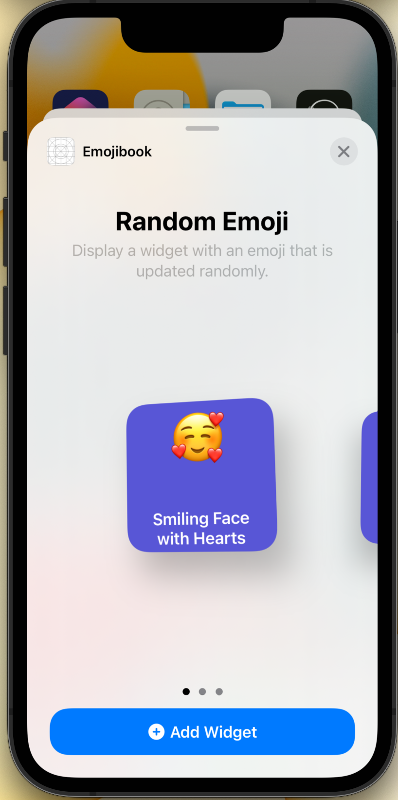
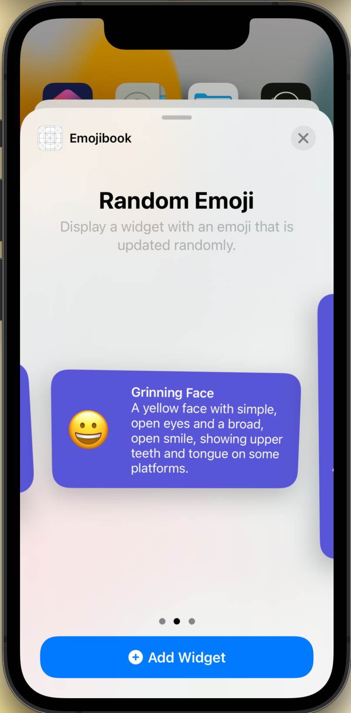
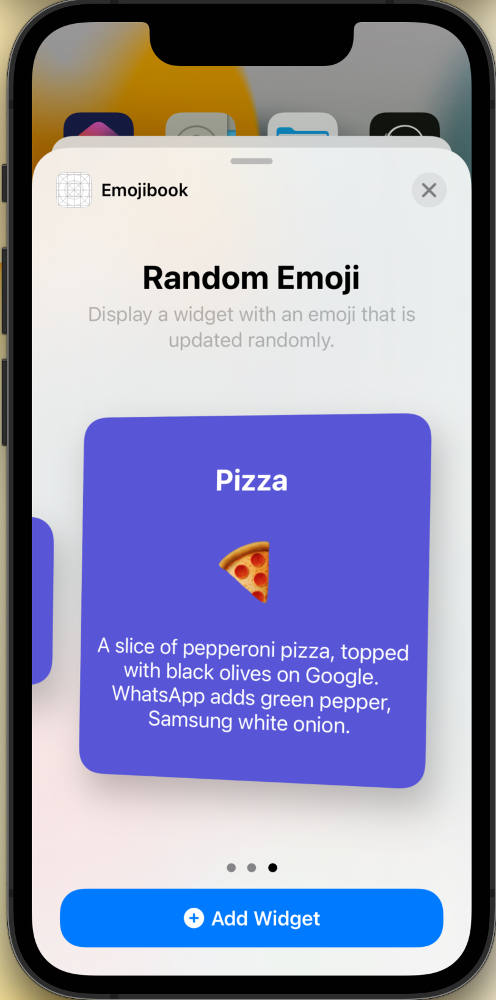
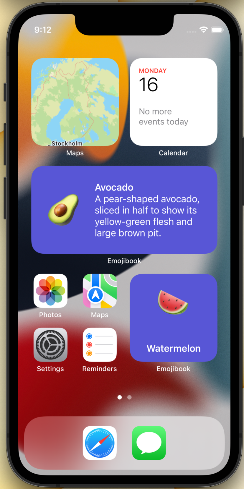

# Emojibook - iOS Widgets

A primer in using Widgets in iOS 15.

## Features

* Different widgets sizes
* Different layouts
* Deeplink support

Small widget             |  Medium widget
:-------------------------:|:-------------------------:
  |  

Large widget             |  Widgets
:-------------------------:|:-------------------------:
  |  

## About

Based on a post series by Ale Patrón [github.com/apatronl](https://github.com/apatronl)

* [Part 1](https://medium.com/swlh/build-your-first-ios-widget-part-1-d2cecdd4020a)
* [Part 2](https://medium.com/swlh/build-your-first-ios-widget-part-2-c69b193b9612)
* [Part 3](https://medium.com/swlh/build-your-first-ios-widget-part-3-36ba53033e33)
